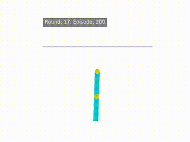

# oderl_true_dynamics

## Project Overview
This project focuses on the dynamics of reinforcement learning environments, specifically using the OpenAI Gym environments. The goal is to explore and analyze the performance of different policies in these environments.

## Continuous-Time Reinforcement Learning
Continuous-time reinforcement learning is a framework where the decision-making process occurs in continuous time rather than discrete steps. This approach is particularly useful for modeling real-world systems that evolve continuously over time. The project investigates continuous-time RL methods and tests them under the assumption of true dynamics scenarios.

## Installation Instructions
To set up the environment, ensure you have Python installed. You can install the required packages using the following command:

```bash
pip install -r oderl_true_dynamics/installed_packages.txt
```

## Usage
To run the code, you can use the provided Python scripts. For example, to execute the main runner script, use:

```bash
python oderl_true_dynamics/runner.py
```

For specific environments, use the following commands:
- **Cartpole**: `python oderl_true_dynamics/runner_cp_cp.py`
- **Acrobot**: `python oderl_true_dynamics/runner_acro.py`

## Results
Below are sample test results from different environments:

<table>
  <tr>
    <td><strong>Pendulum</strong></td>
    <td><strong>Cartpole</strong></td>
  </tr>
  <tr>
    <td></td>
    <td></td>
  </tr>
  <tr>
    <td><strong>Cartpole Swing-up</strong></td>
    <td><strong>Acrobot</strong></td>
  </tr>
  <tr>
    <td></td>
    <td></td>
  </tr>
</table>

### Key Components:
- **System Dynamics (`basic_mdl.py`)**  
  - Defines the differential equations governing environment behavior.
  - Models environment evolution under control policies.

- **Training and Evaluation (`runner.py`)**  
  - Runs reinforcement learning simulations on different OpenAI Gym environments.
  - Logs results and policy performance metrics.

- **Policy (`policies.py`)**  
  - Defines the control policy structure.
  - Implements the policy network architecture.

- **Utils (`utils.py`)**  

## Disclaimer
This project is an investigation into continuous-time reinforcement learning methods, assuming true dynamics scenarios. It is inspired by the work of Çağatay Yıldız, and the Continuous-Time Model-Based Reinforcement Learning paper. Code is mostly taken from the original repo, and modified to fit the needs of the project.

## License
This project is licensed under the MIT License. See the [LICENSE](./LICENSE) file for more details.

## References

- C. Yildiz and J. Setpal, "Continuous-Time Model-Based Reinforcement Learning," in *Proceedings of the International Conference on Machine Learning (ICML)*, 2021.